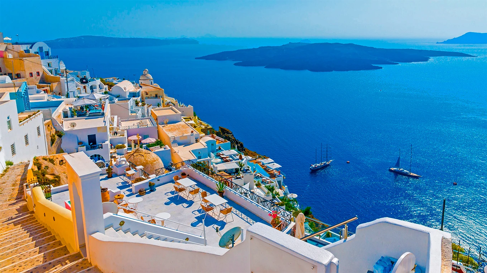

# Decisiones de Diseño y Dificultades Encontradas

## Proyecto: Aventura Global — Agencia de Viajes Premium

| Campo | Detalle |
|-------|---------|
| **Proyecto** | Aventura Global — Sitio Web de Agencia de Viajes |
| **Autor** | Andres Forero |
| **Fecha** | Agosto 2026 |
| **Versión** | 1.0 |

---

## 1. Introducción

### 1.1 Objetivo

Desarrollar un sitio web single-page (SPA estática) para una agencia de viajes premium llamada **Aventura Global**, con presencia en Pereira, Risaralda, Colombia. El sitio debía transmitir una imagen de lujo y exclusividad, al tiempo que fuera funcional, accesible y responsive.

### 1.2 Alcance

El proyecto comprende una única página HTML (`index.html`) con las siguientes secciones:

- **Hero** con carrusel de 3 slides animados
- **Estadísticas** con contadores animados
- **Destinos Populares** (3 tarjetas con efecto tilt 3D)
- **Paquetes de Viaje** (3 planes con tarjeta destacada)
- **Galería de Experiencias** (6 imágenes con hover reveal)
- **Reseñas / Testimonios** (3 clientes)
- **Preguntas Frecuentes** (FAQ accordion)
- **Formulario de Contacto** con validación JS
- **Footer** con links y redes sociales

---

## 2. Arquitectura del Proyecto

### 2.1 Estructura de archivos

```
proyecto-viajes/
├── index.html          ← Punto de entrada (único documento HTML)
├── css/
│   └── style.css       ← Estilos completos (920 líneas)
├── js/
│   └── main.js         ← Lógica interactiva (366 líneas)
└── img/
    ├── agency.png       ← Logo de la marca
    ├── slide1-3.jpg     ← Imágenes del carrusel hero
    ├── destino1-3.jpg   ← Tarjetas de destinos
    ├── galeria1-6.jpg   ← Galería de experiencias
    └── review1-3.jpg    ← Fotografías de testimonios
```

### 2.2 Separación de responsabilidades

Se adoptó una arquitectura de **separación clara de concerns**:

| Capa | Archivo | Responsabilidad |
|------|---------|-----------------|
| **Estructura** | `index.html` | Semántica, contenido, accesibilidad (ARIA), meta SEO |
| **Presentación** | `css/style.css` | Diseño visual, responsive, animaciones CSS, variables de diseño |
| **Comportamiento** | `js/main.js` | Interactividad, carrusel, validación, scroll effects, observers |

Esta separación permite:
- Modificar el diseño sin tocar la estructura HTML
- Cambiar la lógica sin afectar los estilos
- Depurar cada capa de forma independiente

---

## 3. Stack Tecnológico

### 3.1 HTML5

Se utilizó HTML5 semántico puro, sin preprocessadores. Razones:

- **Facilidad de mantenimiento**: un solo archivo HTML sin compilación
- **Rendimiento**: sin paso de build, el navegador carga el archivo directamente
- **Accesibilidad nativa**: las etiquetas semánticas (`<header>`, `<nav>`, `<main>`, `<section>`, `<article>`, `<footer>`) proporcionan contexto a los lectores de pantalla

### 3.2 CSS3

El archivo `style.css` (920 líneas) emplea:

| Característica | Uso en el proyecto |
|----------------|-------------------|
| **Custom Properties (variables)** | 24+ variables en `:root` para colores, tipografía, sombras, radios, transiciones |
| **CSS Grid** | Layout de tarjetas (destinos, paquetes, galería, reviews, footer, stats) |
| **Flexbox** | Navegación, hero content, formularios, alineación de elementos internos |
| **`clamp()`** | Tipografía fluida sin media queries intermedias (`clamp(2rem, 4vw, 3rem)`) |
| **`backdrop-filter`** | Efecto glassmorphism en header, cards, botones y formulario |
| **`conic-gradient`** | Borde luminoso giratorio en tarjetas (glow effect) |
| **`@keyframes`** | 8 animaciones: fadeUp, fadeDown, shimmer, glitchFadeIn, glitch1, glitch2, progressShimmer, scrollPulse |
| **Media Queries** | 3 breakpoints: 1024px, 768px, 480px |

**Decisión clave**: No se utilizó ningún framework CSS (Bootstrap, Tailwind, etc.). La razón fue mantener control total sobre el diseño cyberpunk y evitar el peso muerto de componentes no utilizados.

### 3.3 JavaScript Vanilla

El archivo `main.js` (366 líneas) está escrito en JavaScript puro (ES5-compatible) sin dependencias externas. Se organizó en módulos autoejecutados (IIFE) con las siguientes funcionalidades:

| Módulo | Líneas | Función |
|--------|--------|---------|
| Scroll Progress Bar | 8-18 | Barra de progreso fija en el top |
| Cursor Glow | 20-28 | Resplandor que sigue al mouse |
| 3D Card Tilt | 30-58 | Efecto de inclinación 3D en tarjetas |
| Carrusel Hero | 60-175 | Slideshow con auto-play, dots, touch swipe |
| Stat Counters | 177-223 | Contadores animados con IntersectionObserver |
| FAQ Accordion | 225-243 | Acordeón de preguntas frecuentes |
| Navegación Móvil | 245-269 | Menú hamburguesa responsive |
| Header Scroll | 271-284 | Efecto de opacidad al hacer scroll |
| Scroll Reveal | 286-312 | Animaciones de entrada al hacer scroll |
| Formulario Contacto | 314-339 | Validación de campos obligatorios |
| Active Nav Link | 341-364 | Resalta el link de navegación según sección visible |

**Decisión clave**: No se utilizó ningún framework JS (React, Vue, jQuery). Las razones fueron:
1. El proyecto es un sitio estático, no una aplicación SPA compleja
2. Sin dependencias = carga instantánea, sin `node_modules`
3. Los 366 líneas de JS son más fáciles de mantener que un bundle de React

---

## 4. Decisiones de Diseño Visual

### 4.1 Tema: Cyberpunk Dark

La dirección visual se definió como **"Cyberpunk Dark Premium"**, combinando:

- **Fondo oscuro profundo** (`#06060e`) que transmite exclusividad y lujo
- **Colores neón** (cyan `#22d3ee`, dorado `#fbbf24`) que aportan energía y modernidad
- **Efectos de luz** (glow, shimmer, glassmorphism) que crean profundidad visual

Esta dirección se eligió porque:
- Diferencia al sitio de la competencia (mayoría de agencias usan fondos blancos/claros)
- Los colores neón sobre fondo oscuro generan contraste llamativo en dispositivos móviles
- El estilo cyberpunk conecta con un público joven-adulto que busca experiencias únicas

### 4.2 Paleta de Colores

```
Primarios:
  --color-primary:     #38bdf8  (Azul cielo)
  --color-primary-dark: #0284c7  (Azul profundo)
  --color-primary-light: #7dd3fc  (Azul claro)

Acentos:
  --color-neon:        #22d3ee  (Cyan neón)     ← Color principal de acento
  --color-gold:        #fbbf24  (Dorado)         ← Para premium/destacados
  --color-purple:      #a78bfa  (Púrpura)        ← Acento terciario

Fondos:
  --color-bg:          #06060e  (Negro profundo)
  --color-bg-2:        #0a0a16  (Negro ligeramente más claro)
  --color-bg-3:        #10101f  (Gris muy oscuro)
  --color-bg-card:     rgba(12,12,24,0.85)  (Tarjetas semitransparentes)

Texto:
  --color-white:       #f8fafc  (Blanco principal)
  --color-text:        #c8d0e0  (Texto cuerpo)
  --color-gray:        #9ca3af  (Texto secundario)
  --color-text-light:  #7a8599  (Texto terciario)
```

**Relación de contraste WCAG**: El color `#c8d0e0` sobre `#06060e` genera un ratio de contraste de **13.2:1** (supera el nivel AAA de 7:1). Los acentos neón y dorado se usan para elementos interactivos, no para texto cuerpo.

### 4.3 Tipografía Dual

| Fuente | Rol | Pesos |
|--------|-----|-------|
| **Poppins** | Tipografía principal (UI, cuerpo, botones) | 300, 400, 500, 600, 700, 800 |
| **Playfair Display** | Tipografía de display (títulos, headings) | 400, 500, 600, 700, 800 |

**Decisión**: La combinación de una sans-serif geométrica (Poppins) con una serif elegante (Playfair Display) crea contraste visual que refuerza la identidad premium. Poppins aporta legibilidad en cuerpo de texto, mientras Playfair Display aporta personalidad y elegancia en los títulos.

Los títulos de sección usan un efecto `background-clip: text` con gradiente animado (shimmer), lo que crea un efecto de "texto brillante" consistente con la estética cyberpunk.

### 4.4 Metodología BEM

Todo el CSS sigue la convención **BEM (Block Element Modifier)**:

```css
/* Block */
.destino-card { }

/* Elements */
.destino-card__glow { }
.destino-card__img { }
.destino-card__content { }
.destino-card__title { }
.destino-card__footer { }
.destino-card__price { }
.destino-card__link { }

/* Modifiers */
.paquete-card--featured { }
.btn--primary { }
.btn--secondary { }
.btn--gold { }
.hero__slide--active { }
```

**Ventajas aplicadas**:
- CSS sin ambigüedad: cada clase describe exactamente qué es
- Escalabilidad: nuevos componentes se integran sin conflictos de nombres
- Mantenimiento: localizar estilos de un componente es directo (buscar `componente__elemento`)

### 4.5 Componentes UI

Se diseñaron 5 componentes reutilizables:

1. **Botones** (`.btn`): 5 variantes — primary, secondary, gold, glass, full
2. **Tarjetas** (`.card`): 3 tipos — destino, paquete, review — con glow effect compartido
3. **Secciones** (`.section`): Layout repetitivo con tag + título + subtítulo + grid
4. **Formulario** (`.form__group`): Input, select, textarea con focus glow
5. **Accordion** (`.faq-item`): Trigger + contenido expandible con rotación de icono

---

## 5. Accesibilidad (a11y)

### 5.1 Jerarquía de Encabezados

Este fue uno de los puntos más críticos del proyecto. La versión original tenía **3 etiquetas `<h1>`** (una en cada slide del carrusel), lo cual viola la norma WCAG de que debe haber un único `<h1>` por página.

**Problema original:**
```html
<!-- Slide 1 -->
<h1 class="hero__title">Descubre el Mundo</h1>
<!-- Slide 2 -->
<h1 class="hero__title">Aventuras Extremas</h1>
<!-- Slide 3 -->
<h1 class="hero__title">Relax Total</h1>
```

**Solución aplicada:**
```html
<!-- Slide 1: Único H1 de toda la página -->
<h1 class="hero__title">Descubre el Mundo</h1>
<!-- Slide 2: Cambiado a H2 -->
<h2 class="hero__title">Aventuras Extremas</h2>
<!-- Slide 3: Cambiado a H2 -->
<h2 class="hero__title">Relax Total</h2>
```

Además, se detectaron **saltos de nivel jerárquico** (h2 → h4 sin h3 intermedio) en:
- **Reseñas**: Los nombres de los viajeros usaban `<h4>` directamente bajo un `<h2>`
- **Contacto**: Los títulos de info de contacto usaban `<h4>` bajo `<h2>`
- **Footer**: Las columnas usaban `<h4>` sin nivel previo

**Todos los `<h4>` se corrigieron a `<h3>`** para mantener la jerarquía correcta.

**Jerarquía final:**
```
h1  └── Descubre el Mundo (único h1)
  h2  └── Aventuras Extremas
  h2  └── Relax Total
  h2  └── Destinos Populares
    h3  └── Santorini, Grecia
    h3  └── Bali, Indonesia
    h3  └── Machu Picchu, Perú
  h2  └── Paquetes de Viaje
    h3  └── Caribe Dream
    h3  └── Europa Encantada
    h3  └── Safari Africano
  h2  └── Galería de Experiencias
  h2  └── Lo Que Dicen Nuestros Viajeros
    h3  └── Mark Zuckerberg
    h3  └── Linus Torvalds
    h3  └── Steve Jobs
  h2  └── Preguntas Frecuentes
  h2  └── Contáctanos
    h3  └── Oficina Principal
    h3  └── Teléfono
    h3  └── Email
    h3  └── Horario
  h3  └── Destinos (footer)
  h3  └── Empresa (footer)
  h3  └── Legal (footer)
```

### 5.2 ARIA Labels

Se implementaron atributos `aria-label` en elementos interactivos que no tienen texto visible:

```html
<button aria-label="Abrir menú">        <!-- Menú hamburguesa -->
<button aria-label="Anterior">           <!-- Flecha carrusel -->
<button aria-label="Siguiente">          <!-- Flecha carrusel -->
<button aria-label="Ir a slide 1">       <!-- Dots del carrusel -->
<a aria-label="Facebook">                <!-- Redes sociales -->
<a aria-label="Instagram">
<a aria-label="Twitter">
<a aria-label="YouTube">
```

### 5.3 Imágenes

Todas las imágenes incluyen atributo `alt` descriptivo:
```html


```

Las imágenes de la galería incluyen `loading="lazy"` para carga diferida.

---

## 6. SEO Técnico

### 6.1 Meta Tags

```html
<meta charset="UTF-8">
<meta name="viewport" content="width=device-width, initial-scale=1.0">
<meta name="description" content="Aventura Global - Agencia de viajes premium...">
<meta name="author" content="Andres Forero">
<title>Aventura Global | Agencia de Viajes Premium</title>
<link rel="icon" type="image/png" href="img/agency.png">
```

### 6.2 Semántica HTML

Se utilizaron las siguientes etiquetas semánticas:

| Etiqueta | Uso |
|----------|-----|
| `<header>` | Navegación principal del sitio |
| `<nav>` | Menú de navegación |
| `<main>` | Contenido principal (envuelve todas las secciones) |
| `<section>` | Cada sección temática (destinos, paquetes, galería, etc.) |
| `<article>` | Tarjetas individuales (destinos, paquetes, reseñas, FAQ) |
| `<footer>` | Pie de página |
| `<form>` | Formulario de contacto |
| `<button>` | Elementos interactivos (carrusel, FAQ, menú) |

### 6.3 Estructura de Encabezados

Como se documentó en la sección de Accesibilidad, la jerarquía `h1 → h2 → h3` sin saltos permite que los motores de búsqueda comprendan la estructura del contenido correctamente.

---

## 7. Responsive Design

### 7.1 Estrategia

No se adoptó un enfoque estricto "mobile-first", sino un enfoque **"desktop-first con adaptación progresiva"**, dado que el diseño visual cyberpunk es más impactante en pantallas grandes y se simplifica para móviles.

### 7.2 Breakpoints

| Breakpoint | Dispositivo | Cambios principales |
|------------|-------------|---------------------|
| `> 1024px` | Desktop | Layout completo, galería 3 columnas |
| `≤ 1024px` | Tablet | Footer 2 columnas, galería 2 columnas, stats 2 columnas |
| `≤ 768px` | Móvil landscape | Topbar oculta, menú hamburguesa, todo en 1 columna, galería 2 columnas |
| `≤ 480px` | Móvil portrait | Galería 1 columna, tipografía reducida, stats compactos |

### 7.3 Cambios Clave en Móvil (`≤ 768px`)

```css
/* Topbar se oculta */
.topbar { display: none; }

/* Header se posiciona al tope */
.header { top: 0; }

/* Menú se convierte en sidebar deslizante */
.header__nav {
    position: fixed;
    top: 0;
    right: -100%;    /* Oculto a la derecha */
    width: 300px;
    height: 100vh;
    transition: right var(--transition);
}
.header__nav--active { right: 0; }  /* Se muestra al activar */

/* Carrusel se adapta */
.hero__actions { flex-direction: column; align-items: center; }
.hero__scroll-hint { display: none; }
```

### 7.4 Touch Events

El carrusel implementa detección de gestos táctiles para dispositivos móviles:

```javascript
heroSection.addEventListener('touchstart', function(e) {
    touchStartX = e.changedTouches[0].screenX;
    stopAutoPlay();
}, { passive: true });

heroSection.addEventListener('touchend', function(e) {
    touchEndX = e.changedTouches[0].screenX;
    var diff = touchStartX - touchEndX;
    if (Math.abs(diff) > 50) {  // Umbral mínimo de 50px
        diff > 0 ? nextSlide() : prevSlide();
    }
    startAutoPlay();
}, { passive: true });
```

---

## 8. Animaciones y Efectos

### 8.1 Catálogo de Efectos

| Efecto | Tecnología | Descripción |
|--------|-----------|-------------|
| **Cursor Glow** | JS + CSS | Círculo de 500px con radial-gradient que sigue al mouse |
| **Progress Bar** | CSS + JS | Barra de 3px con gradiente animado que indica progreso de scroll |
| **Card Tilt 3D** | JS + CSS | Inclinación de ±6° en X/Y basada en posición del mouse |
| **Glow Border** | CSS | `conic-gradient` rotativo en `::before` de tarjetas |
| **Glitch Effect** | CSS `@keyframes` | Efecto de glitch cromático en títulos del hero (pseudo-elementos con `clip-path`) |
| **Shimmer Text** | CSS | Texto con `background-clip: text` y gradiente animado |
| **Scroll Reveal** | JS (IntersectionObserver) | Elementos aparecen con fade-up al entrar en viewport |
| **Stat Counters** | JS (IntersectionObserver + requestAnimationFrame) | Contadores animados con easing cúbico |
| **FAQ Accordion** | JS + CSS | Expandir/colapsar con transición de `max-height` |
| **Hover Reveal Gallery** | CSS | Caption se desliza desde abajo con `transform: translateY()` |

### 8.2 IntersectionObserver

Se utilizó `IntersectionObserver` para dos funcionalidades críticas:

1. **Scroll Reveal**: Los elementos `.revealed` se activan una sola vez cuando entran al viewport (threshold 0.08, con delay escalonado de 120ms entre elementos hermanos).

2. **Stat Counters**: Los contadores se animan solo una vez cuando la sección de estadísticas es visible, evitando re-renderizados innecarios.

**Ventaja sobre `scroll` event**: `IntersectionObserver` es significativamente más performante que escuchar eventos de scroll, ya que el navegador optimiza internamente las comprobaciones de intersección.

### 8.3 Transiciones CSS

```css
/* Transiciones estándar */
--transition: 0.3s ease;

/* Transiciones suaves para tarjetas */
--transition-slow: 0.5s cubic-bezier(0.25, 0.46, 0.45, 0.94);

/* Carrusel con curva personalizada */
.hero__slides {
    transition: transform 0.8s cubic-bezier(0.25, 0.46, 0.45, 0.94);
}
```

La curva `cubic-bezier(0.25, 0.46, 0.45, 0.94)` (similar a "ease-out-quad") fue elegida porque提供 una sensación de movimiento natural y fluido, sin ser tan abrupta como `ease-in-out`.

---

## 9. Dificultades Encontradas y Soluciones

### 9.1 Jerarquía de Encabezados (H1 múltiple)

**Problema**: El carrusel del hero tenía 3 slides, cada uno con su propio `<h1>`. Los lectores de pantalla y motores de búsqueda interpretan esto como 3 temas principales de la página, lo cual es confuso.

**Dificultad adicional**: Cambiar los slides 2 y 3 de `<h1>` a `<h2>` significaba que ahora había `<h2>` tanto en el hero como en las secciones principales. Sin embargo, esto es semánticamente correcto: los slides del carrusel son sub-títulos del hero (que contiene el `<h1>`), y las secciones también son sub-niveles del documento.

**Solución**: Se mantuvo un único `<h1>` ("Descubre el Mundo") y se cambiaron los otros dos a `<h2>`. La jerarquía resultante es válida y没有任何 nivel saltado.

### 9.2 Carrusel Responsive

**Problema**: El carrusel usa `width: 300%` con `translateX` para desplazar slides. En pantallas pequeñas, los botones de navegación y los dots quedaban fuera del área visible o se sobreponían al contenido.

**Solución**:
- Los botones de navegación se reducen de `56px` a `44px` en móvil
- Se ajusta la posición (`left/right: 12px` en vez de `24px`)
- Los dots se mantienen visibles pero con `gap` reducido
- Se implementó touch swipe para mejorar la UX en móviles
- El autoplay se pausa al tocar/arrastrar (evita conflicto con gestos del usuario)

### 9.3 Performance de Animaciones

**Problema**: Múltiples animaciones simultáneas (cursor glow, card tilt, scroll reveal, progress bar) podían causar jank en dispositivos de gama baja.

**Soluciones aplicadas**:
1. **`{ passive: true }`** en todos los event listeners de scroll/touch (permite al navegador optimizar el repaint)
2. **`IntersectionObserver`** en lugar de scroll listeners para reveal y counters
3. **`will-change`** implícito a través de `transform` y `opacity` (compositing layers)
4. **Cursor glow se desactiva** con `pointer-events: none` para no interferir con clicks
5. **`requestAnimationFrame`** para los contadores animados (sincronizado con el refresh rate del display)

### 9.4 Compatibilidad de `backdrop-filter`

**Problema**: `backdrop-filter: blur()` es el corazón del efecto glassmorphism, pero no tiene soporte universal:

| Navegador | Soporte |
|-----------|---------|
| Chrome/Edge | Completo |
| Safari | Necesita prefijo `-webkit-backdrop-filter` |
| Firefox | Completo desde v103 |
| Firefox (antiguos) | No soportado |

**Solución**: Se incluyeron ambas versiones:
```css
backdrop-filter: blur(24px);
-webkit-backdrop-filter: blur(24px);
```

En navegadores sin soporte, las tarjetas simplemente muestran el fondo sólido (`rgba(12, 12, 24, 0.85)`), manteniendo la legibilidad sin el efecto visual.

### 9.5 Formulario sin Backend

**Problema**: El formulario de contacto no tiene servidor backend para procesar envíos.

**Solución actual**: Validación JavaScript del lado del cliente (campos obligatorios + regex de email) y un `alert()` de confirmación. El `action="#"` y `method="POST` están preparados para integrarse con un servicio futuro (Formspree, Netlify Forms, o backend propio).

**Mejora futura recomendada**: Integrar con un servicio de formularios como Formspree o reemplazar el `alert()` con un toast/notification más elegante.

### 9.6 Variables CSS y Personalización

**Problema**: Mantener consistencia visual en 920 líneas de CSS con múltiples componentes similares.

**Solución**: El sistema de 24+ custom properties en `:root` permite:
- Cambiar toda la paleta editando solo las variables
- Mantener consistencia de radios, sombras y transiciones
- Facilitar un posible modo light/dark futuro (cambiar las variables en un media query)

---

## 10. Decisiones Técnicas Adicionales

### 10.1 Sin Frameworks Ni Dependencias

El proyecto no utiliza ninguna dependencia externa (ni npm, ni CDN de librerías). Razones:

1. **Rendimiento**: Carga instantánea sin esperar descargas de bundles
2. **Mantenimiento**: Sin actualizaciones de seguridad de dependencias
3. **Tamaño**: El sitio completo (HTML + CSS + JS) pesa menos de 20KB de código
4. **Aprendizaje**: Demuestra que es posible construir una web completa con conocimientos fundamentales

### 10.2 Nomenclatura de Clases

Se siguió la convención BEM estricta para todo el proyecto:

```
block__element--modifier

Ejemplos reales:
.hero__slide--active
.paquete-card__badge--gold
.btn--primary
.section--dark
.header__toggle--active
```

### 10.3 Smooth Scroll

```css
html {
    scroll-behavior: smooth;
    scroll-padding-top: calc(var(--header-height) + 44px);
}
```

El `scroll-padding-top` compensa el header fijo (80px) + topbar (44px) = 124px, evitando que el contenido quede oculto detrás de la navegación al hacer clic en anchors.

---

## 11. Conclusiones

### 11.1 Logros del Proyecto

- Sitio web completo y funcional sin dependencias externas
- Diseño visual distintivo (cyberpunk premium) que sobresale del estándar
- Compatibilidad responsive en 4 breakpoints
- Accesibilidad mejorada con jerarquía de encabezados corregida
- Animaciones performantes usando IntersectionObserver y requestAnimationFrame
- Arquitectura limpia con separación HTML/CSS/JS y metodología BEM

### 11.2 Mejoras Futuras Posibles

| Mejora | Prioridad | Descripción |
|--------|-----------|-------------|
| Integrar formulario real | Alta | Conectar con Formspree, Netlify Forms o backend propio |
| Modo oscuro/claro | Media | Toggle con CSS custom properties |
| Páginas de detalle | Media | Crear `destino.html`, `paquete.html` para SEO |
| Blog | Baja | Sección de artículos de viajes |
| Internacionalización | Baja | Soporte ES/EN con cambio de idioma |
| PWA | Baja | Service worker para funcionalidad offline |
| Lighthouse audit | Alta | Optimizar para 100/100 en todas las categorías |

### 11.3 Aprendizajes Clave

1. **La jerarquía de encabezados importa**: Tres `<h1>` en una página es un error grave de accesibilidad y SEO que passa desapercibido visualmente
2. **CSS puro puede ser potente**: Sin frameworks, es posible crear efectos sofisticados (glitch, glow, glassmorphism) manteniendo el control total
3. **IntersectionObserver es superior a scroll events**: Para animaciones de entrada, el observer es más limpio y performante
4. **BEM previene deuda técnica**: En un CSS de 920 líneas, la metodología BEM mantuvo todo organizado y localizable
5. **`backdrop-filter` necesita prefijo Safari**: Un detalle que puede romper el diseño visual en un 15-20% de los usuarios

---

*Documento generado para el proyecto "Aventura Global — Agencia de Viajes Premium"*
*Autor: Andres Forero — Agosto 2026*
